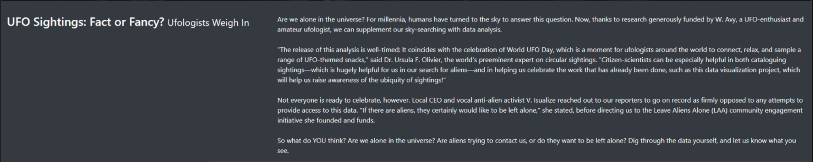
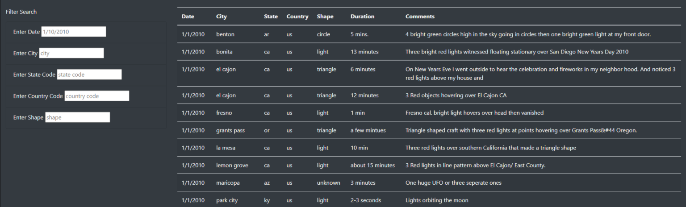

# UFOs

## Purpose
The purpose of this project was to create a visually appealing html page to display UFO sighting data stored in a JavaScript array.  The client, a data journalist, has requested that the following items be displayed on the web page:

1. Header
2. Navigation Bar
3. Article Title
4. Article Paragraph
5. Table of the data which could be filtered by:
    1. Date
    2. City
    3. State
    4. Country 
    5. Shape of the sighting

## Resources
Data: data.js 
Software: Visual Studio Code, Javascript, HTML, CSS, Bootstrap

## Results
The new webpage that was designed to meet the desired deliverables is visually appealing and easy to use.  When the page is first opened, the visitor will see the Navigation Bar at the very top of the page where it says UFO Sightings.  Clicking on that bar will refresh the page and reload the entire data table without any filters applied. 

Just below the Navigation Bar is the Jumbotron with the title of the page in large letters and a background photo to catch the eye of the visitor.  

Below the jumbotron is the article title and the article paragraph that the client wrote.  To add a bit of contrast to the centering of objects on the page, the title of the article was added to the left side of the screen with the paragraph on the right side of the screen.  This was done solely to enhance the appearance of the webpage and make it more visually appealing to the reader/user.

Below the article components on the webpage is the data, along with all of the available filtering options.  Again, these were placed side-by-side on the page with the filters on the left and data table on the right, to make the page appear attractive but also for functionality to make it easy to see what the filters are doing.

One thing to note about the filters is that in each filter, there is a placeholder describing what type of data the user will need to input to filter the data.  So even though there are values in each of the filters, the data has not yet been filtered.  The user will need to enter a value into one or more of the input boxes and press "Enter" before the table updates.  With that in mind, the filtering is very simple and very helpful in allowing the user to dig down to the specific data they would like to see.  Follow the example below to see how each of the five filters work.

## Summary
- One drawback of this new design
    - Inputs must match the data exactly.  CA can't be used in place of ca.  The date can't be entered as 01/01/2010 but rather must be entered as 1/1/2010
- Two recommendations for further development
    - Reset button to reset the filters
    - Filtering by date range
