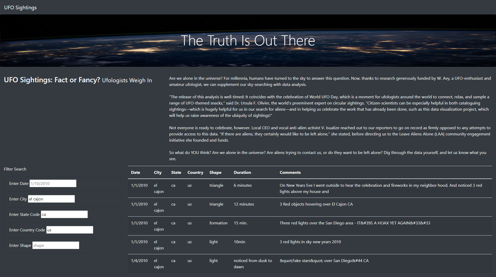

# UFO Sightings Webpage

## Purpose
The purpose of this project was to create a visually appealing html page to display UFO sighting data stored in a JavaScript array.  The client, a data journalist, has requested that the following items be displayed on the web page:

1. Header
2. Navigation Bar
3. Article Title
4. Article Paragraph
5. Table of the data which could be filtered by:
    1. Date
    2. City
    3. State
    4. Country 
    5. Shape of the sighting

## Resources
Data: data.js 
Software: Visual Studio Code, Javascript, HTML, CSS, Bootstrap

## Results
The new webpage that was designed to meet the desired deliverables is visually appealing and easy to use.  When the page is first opened, the visitor will see the Navigation Bar at the very top of the page where it says UFO Sightings.  Clicking on that bar will refresh the page and reload the entire data table without any filters applied. 

Just below the Navigation Bar is the Jumbotron with the title of the page in large letters and a background photo to catch the eye of the visitor.  

Below the jumbotron is the article title and the article paragraph that the client wrote.  To add a bit of contrast to the centering of objects on the page, the title of the article was added to the left side of the screen with the paragraph on the right side of the screen.  This was done solely to enhance the appearance of the webpage and make it more visually appealing to the reader/user.

Below the article components on the webpage is the data, along with all of the available filtering options.  Again, these were placed side-by-side on the page with the filters on the left and data table on the right, to make the page appear attractive but also for functionality to make it easy to see what the filters are doing.

One thing to note about the filters is that in each filter, there is a placeholder describing what type of data the user will need to input to filter the data.  So even though there are values in each of the filters, the data has not yet been filtered.  The user will need to enter a value into one or more of the input boxes and press "Enter" before the table updates.  With that in mind, filtering is very simple and very helpful in allowing the user to dig down to the specific data they would like to see.  Follow the example below to see how each of the five filters work.  The filters are not discussed in the listed order on the page but rather in a way that allows for each filter to be used subsequently to drill down to only one data point.

1. The first filter that was be used is the country code filter.  For this filter, the country code must be entered as two undercase letters.  In this example the code "us" was used to filter only data for the United States, but "ca" would have been another option to filter for only Canadian sightings.  After typing "us" in the input box and pressing "Enter" on the keyboard, the data table doesn't appear to have changed, but a closer sid-by-side comparison shows that a few lines (any that weren't "us" sightings) were removed from the data.

<table>
    <tr>
        <th> Unfiltered </th>
        <th> Filtered by "us" </th>
    </tr>
    <tr> 
        <td>
            
        </td>
        <td> 
            
        </td>
    </tr>
</table>

2. The second filter that was used is the state code filter.  This filter is similar to the country code in that the state code must be entered as two undercase letters.  For this example, "ca" was used to filter the data for only California sightings.  One important thing to note is that this filter is applied in addition to all previous filters that have been applied.  If the user wanted to clear out any previous filters, they would have to delete the entry from the input box for the filter they want to remove, or click on the Navigation Bar at the top of the page to refresh the page.  After typing "ca" in the state code input box and pressing "Enter", the data table updates to include only the UFO sightings in California.

3. The third filter that was applied is the city filter.  To activate this filter, the user must enter the city name in all lowercase letters and then press "Enter".  In this example the data was filtered to the city of "el cajon".  Again, this filter was applied in addition to the previous filters so the data table updated to include only sightings reported in El Cajon, California.  As seen in the photo below, this filter narrowed the data down by quite a bit!

4. The fourth filter that was applied in this example is the date filter.  The date must be entered as #/#/####, #/##/####, or ##/##/#### depending on if the month and day are single or double digit numbers.   The year must always be entered as a four digit year, the day and month are listed without zero's in front of single digit numbers, and the separator between the day, month and year is required to be a "/".  If the date is not entered in exactly this format, the filter will be applied and no data will be returned because the date format won't match any of the dates in the data.  In this example, the date "1/1/2010" was entered into the input box and "Enter" was pressed to activate the filter.  The data table now only included sighting data from El Cajon, California on 1/1/2010.

5. The last filter that was applied is the shape filter.  This filter must be entered in all lowercase letters.  Any shape can be entered but if the shape entered does not match any of the shapes in the data, the data table will return an empty table.  Also, it is worth noting that the data is somewhat inconsistent when comparing the shape data to the description (Refer to previous photo).  Many sightings have similar descriptions but list different names for the shapes.  Because of this discrepency, the shape filter should be used with caution knowing that it may not return all of the desired data.  For this example, the shape "formation" was entered as the filter and the data returned only sightings from El Cajon, California on 1/1/2010 in the shape of a "formation".

With all the filters applied, the data table was narrowed down to only one sighting.  To clear the filters, the user would need to refresh the page by clicking on "UFO Sightings" on the Navigation Bar or by deleting all of the filter entries and pressing "Enter".

## Summary
One drawback of this webpage is that the filter inputs must match the data exactly.  CA can't be used in place of ca and the date can't be entered as 01/01/2010 but rather must be entered as 1/1/2010.  The filters are case specific and format specific, so if the input doesn't match the data exactly a blank table will be returned with no message letting the user know that there wasn't a match.  This can be frustrating and it can also lead to users being misinformed. The webpage could be better designed to accept any case for letters and any format for a date, and automatically convert the input to the format of the data.

Two recommendations for further development of this webpage are:
    
- *Reset button to reset the filters*:  A reset button would be helpful to have below the filters to make it easier for users to clear out their filters.  They are able to clear the filters currently by clicking on the Navigation Bar at the top of the page, but it is not displayed anywhere to let them know of that option.  Instead, it takes time for the users to clear out each input box individually each time they would like to change the filters.
- *Filtering by date range*:  Being able to filter the data by a range of dates rather than just one date could be helpful for the user.  If someone is trying to compare sighting per month, they are currently unable to filter the data to do that.  They would have to look at each individual date or the entire data set.  Filtering by a date range by entering two dates would make the webpage even more user friendly.
